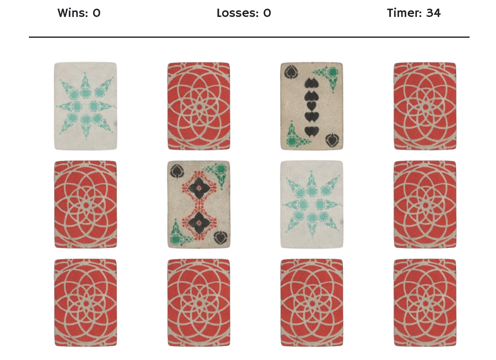

# React Memory Game [-view](https://jessibramwell.github.io/react-memory-game/)
This app is a simple React exercise designed to demonstrate the value of using components and state.

## How to play

Press the 'Play' button to begin a round. A timer will start counting down from 60. Click a card to turn it over. After two cards have been selected, if a match is found, the cards will remain face up and fade to show they are now inactive. If a match isn't found the cards will remain face up for one second to be quickly committed to memory. Try to find all six matching cards before the timer runs out. The game will reset after every round.

## Screenshot
 
 

## Built with:
- React

